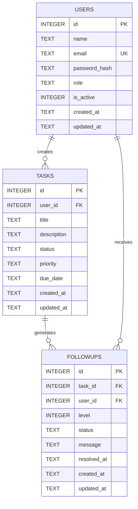

# ER Diagram



## Table Descriptions

### USERS
| Column | Type | Description |
|---|---|---|
| id | INTEGER PK | Auto increment |
| name | TEXT | Full name |
| email | TEXT UNIQUE | Login email |
| password_hash | TEXT | bcrypt hash |
| role | TEXT | `'user'` or `'admin'` |
| is_active | INTEGER | 1 = active, 0 = deactivated |

### TASKS
| Column | Type | Description |
|---|---|---|
| id | INTEGER PK | Auto increment |
| user_id | INTEGER FK | References users.id |
| title | TEXT NOT NULL | Task title |
| description | TEXT | Optional detail |
| status | TEXT | `pending`, `in_progress`, `completed` |
| priority | TEXT | `low`, `medium`, `high` |
| due_date | TEXT | ISO date string |

### FOLLOWUPS
| Column | Type | Description |
|---|---|---|
| id | INTEGER PK | Auto increment |
| task_id | INTEGER FK | References tasks.id |
| user_id | INTEGER FK | References users.id (denormalized for fast query) |
| level | INTEGER | 1 = reminder, 2 = urgent, 3 = critical |
| status | TEXT | `pending` or `resolved` |
| message | TEXT | Auto-generated message based on level |
| resolved_at | TEXT | Null until resolved |

## Constraints

```sql
-- status must be one of allowed values
CHECK (tasks.status IN ('pending', 'in_progress', 'completed'))
CHECK (tasks.priority IN ('low', 'medium', 'high'))
CHECK (followups.level IN (1, 2, 3))
CHECK (followups.status IN ('pending', 'resolved'))
CHECK (users.role IN ('user', 'admin'))
```
