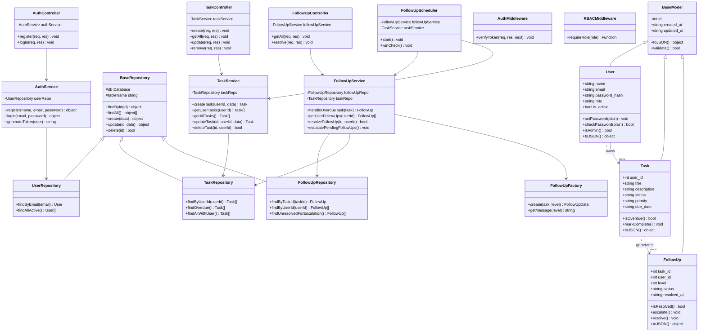

# Class Diagram

```mermaid
classDiagram

    %% ─── Models ───
    class BaseModel {
        +int id
        +string created_at
        +string updated_at
        +toJSON() object
        +validate() bool
    }

    class User {
        +string name
        +string email
        +string password_hash
        +string role
        +bool is_active
        +setPassword(plain) void
        +checkPassword(plain) bool
        +isAdmin() bool
        +toJSON() object
    }

    class Task {
        +int user_id
        +string title
        +string description
        +string status
        +string priority
        +string due_date
        +isOverdue() bool
        +markComplete() void
        +toJSON() object
    }

    class FollowUp {
        +int task_id
        +int user_id
        +int level
        +string status
        +string resolved_at
        +isResolved() bool
        +escalate() void
        +resolve() void
        +toJSON() object
    }

    BaseModel <|-- User
    BaseModel <|-- Task
    BaseModel <|-- FollowUp
    User "1" --> "many" Task : owns
    Task "1" --> "many" FollowUp : generates

    %% ─── Repositories ───
    class BaseRepository {
        #db Database
        #tableName string
        +findById(id) object
        +findAll() object[]
        +create(data) object
        +update(id, data) object
        +delete(id) bool
    }

    class UserRepository {
        +findByEmail(email) User
        +findAllActive() User[]
    }

    class TaskRepository {
        +findByUserId(userId) Task[]
        +findOverdue() Task[]
        +findAllWithUser() Task[]
    }

    class FollowUpRepository {
        +findByTaskId(taskId) FollowUp
        +findByUserId(userId) FollowUp[]
        +findUnresolvedForEscalation() FollowUp[]
    }

    BaseRepository <|-- UserRepository
    BaseRepository <|-- TaskRepository
    BaseRepository <|-- FollowUpRepository

    %% ─── Services ───
    class AuthService {
        -UserRepository userRepo
        +register(name, email, password) object
        +login(email, password) object
        +generateToken(user) string
    }

    class TaskService {
        -TaskRepository taskRepo
        +createTask(userId, data) Task
        +getUserTasks(userId) Task[]
        +getAllTasks() Task[]
        +updateTask(id, userId, data) Task
        +deleteTask(id, userId) bool
    }

    class FollowUpService {
        -FollowUpRepository followUpRepo
        -TaskRepository taskRepo
        +handleOverdueTask(task) FollowUp
        +getUserFollowUps(userId) FollowUp[]
        +resolveFollowUp(id, userId) bool
        +escalatePendingFollowUps() void
    }

    class FollowUpFactory {
        +create(task, level) FollowUpData
        +getMessage(level) string
    }

    AuthService --> UserRepository
    TaskService --> TaskRepository
    FollowUpService --> FollowUpRepository
    FollowUpService --> TaskRepository
    FollowUpService --> FollowUpFactory

    %% ─── Controllers ───
    class AuthController {
        -AuthService authService
        +register(req, res) void
        +login(req, res) void
    }

    class TaskController {
        -TaskService taskService
        +create(req, res) void
        +getAll(req, res) void
        +update(req, res) void
        +remove(req, res) void
    }

    class FollowUpController {
        -FollowUpService followUpService
        +getAll(req, res) void
        +resolve(req, res) void
    }

    AuthController --> AuthService
    TaskController --> TaskService
    FollowUpController --> FollowUpService

    %% ─── Middleware ───
    class AuthMiddleware {
        +verifyToken(req, res, next) void
    }

    class RBACMiddleware {
        +requireRole(role) Function
    }

    %% ─── Scheduler ───
    class FollowUpScheduler {
        -FollowUpService followUpService
        -TaskService taskService
        +start() void
        +runCheck() void
    }

    FollowUpScheduler --> FollowUpService
    FollowUpScheduler --> TaskService
```
