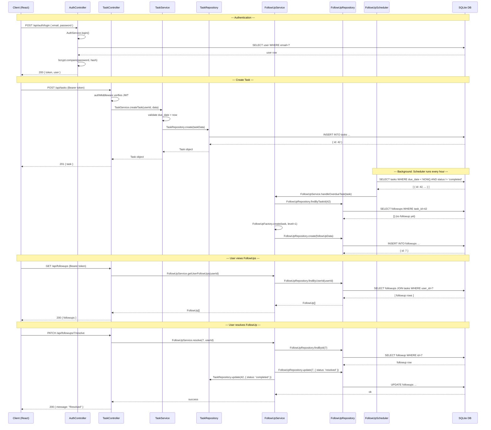
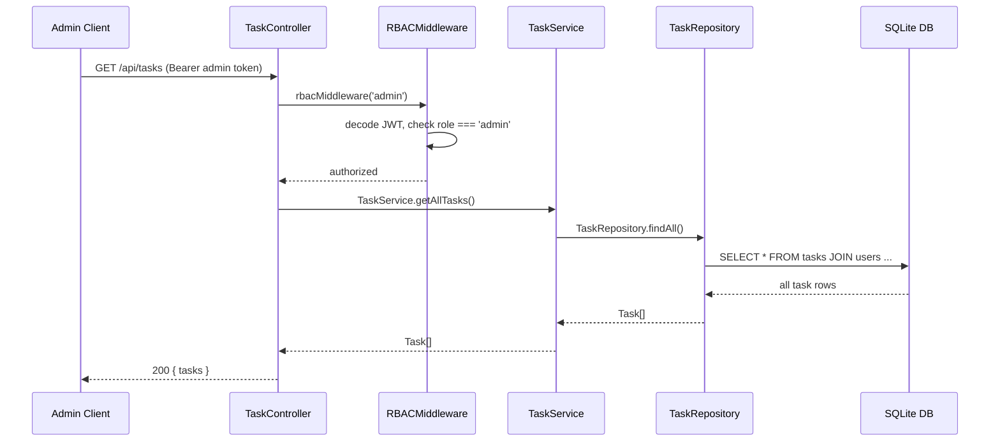

# Sequence Diagram

## Main Flow: User Creates Task → Misses Deadline → FollowUp Generated

```mermaid
sequenceDiagram
    participant C as Client (React)
    participant AC as AuthController
    participant TC as TaskController
    participant TS as TaskService
    participant TR as TaskRepository
    participant FS as FollowUpService
    participant FR as FollowUpRepository
    participant CRON as FollowUpScheduler
    participant DB as SQLite DB

    Note over C,DB: --- Authentication ---
    C->>AC: POST /api/auth/login { email, password }
    AC->>AC: AuthService.login()
    AC->>DB: SELECT user WHERE email=?
    DB-->>AC: user row
    AC->>AC: bcrypt.compare(password, hash)
    AC-->>C: 200 { token, user }

    Note over C,DB: --- Create Task ---
    C->>TC: POST /api/tasks (Bearer token)
    TC->>TC: authMiddleware verifies JWT
    TC->>TS: TaskService.createTask(userId, data)
    TS->>TS: validate due_date > now
    TS->>TR: TaskRepository.create(taskData)
    TR->>DB: INSERT INTO tasks ...
    DB-->>TR: { id: 42 }
    TR-->>TS: Task object
    TS-->>TC: Task object
    TC-->>C: 201 { task }

    Note over CRON,DB: --- Background: Scheduler runs every hour ---
    CRON->>DB: SELECT tasks WHERE due_date < NOW() AND status != 'completed'
    DB-->>CRON: [ { id: 42, ... } ]
    CRON->>FS: FollowUpService.handleOverdueTask(task)
    FS->>FR: FollowUpRepository.findByTaskId(42)
    FR->>DB: SELECT followups WHERE task_id=42
    DB-->>FR: [] (no followup yet)
    FS->>FS: FollowUpFactory.create(task, level=1)
    FS->>FR: FollowUpRepository.create(followUpData)
    FR->>DB: INSERT INTO followups ...
    DB-->>FR: { id: 7 }

    Note over C,DB: --- User views FollowUps ---
    C->>TC: GET /api/followups (Bearer token)
    TC->>FS: FollowUpService.getUserFollowUps(userId)
    FS->>FR: FollowUpRepository.findByUserId(userId)
    FR->>DB: SELECT followups JOIN tasks WHERE user_id=?
    DB-->>FR: [ followup rows ]
    FR-->>FS: FollowUp[]
    FS-->>TC: FollowUp[]
    TC-->>C: 200 { followups }

    Note over C,DB: --- User resolves FollowUp ---
    C->>TC: PATCH /api/followups/7/resolve
    TC->>FS: FollowUpService.resolve(7, userId)
    FS->>FR: FollowUpRepository.findById(7)
    FR->>DB: SELECT followup WHERE id=7
    DB-->>FR: followup row
    FS->>FR: FollowUpRepository.update(7, { status: 'resolved' })
    FS->>TR: TaskRepository.update(42, { status: 'completed' })
    FR->>DB: UPDATE followups ...
    DB-->>FS: ok
    FS-->>TC: success
    TC-->>C: 200 { message: "Resolved" }
```

## Flow: Admin Views All Tasks

```mermaid
sequenceDiagram
    participant A as Admin Client
    participant TC as TaskController
    participant RM as RBACMiddleware
    participant TS as TaskService
    participant TR as TaskRepository
    participant DB as SQLite DB

    A->>TC: GET /api/tasks (Bearer admin token)
    TC->>RM: rbacMiddleware('admin')
    RM->>RM: decode JWT, check role === 'admin'
    RM-->>TC: authorized
    TC->>TS: TaskService.getAllTasks()
    TS->>TR: TaskRepository.findAll()
    TR->>DB: SELECT * FROM tasks JOIN users ...
    DB-->>TR: all task rows
    TR-->>TS: Task[]
    TS-->>TC: Task[]
    TC-->>A: 200 { tasks }
```
