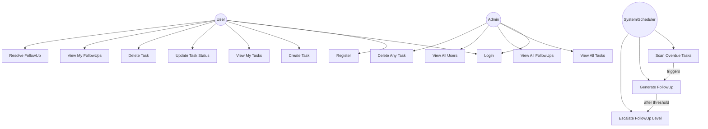

# Use Case Diagram

## Actors

| Actor | Description |
|---|---|
| **User** | Registered user who manages their own tasks |
| **Admin** | Privileged user who can see and manage everything |
| **System/Scheduler** | Background cron job, no human interaction |

## Use Case Descriptions

### UC3 — Create Task
- **Actor**: User
- **Precondition**: User is logged in
- **Flow**: User provides title, description, due date, priority → system saves task with status `pending`
- **Postcondition**: Task appears in user's task list

### UC13–UC15 — FollowUp Engine
- **Actor**: System (automated, runs hourly)
- **Flow**: Scheduler checks all tasks where `due_date < now` AND `status != completed`
  - If no followup exists → create Level 1 followup
  - If Level 1 followup is 2 days old and unresolved → escalate to Level 2
  - If Level 2 followup is 4 days old and unresolved → escalate to Level 3

### UC8 — Resolve FollowUp
- **Actor**: User
- **Precondition**: FollowUp exists and is unresolved
- **Flow**: User marks followup resolved → followup status = `resolved`, task status updated to `completed`
